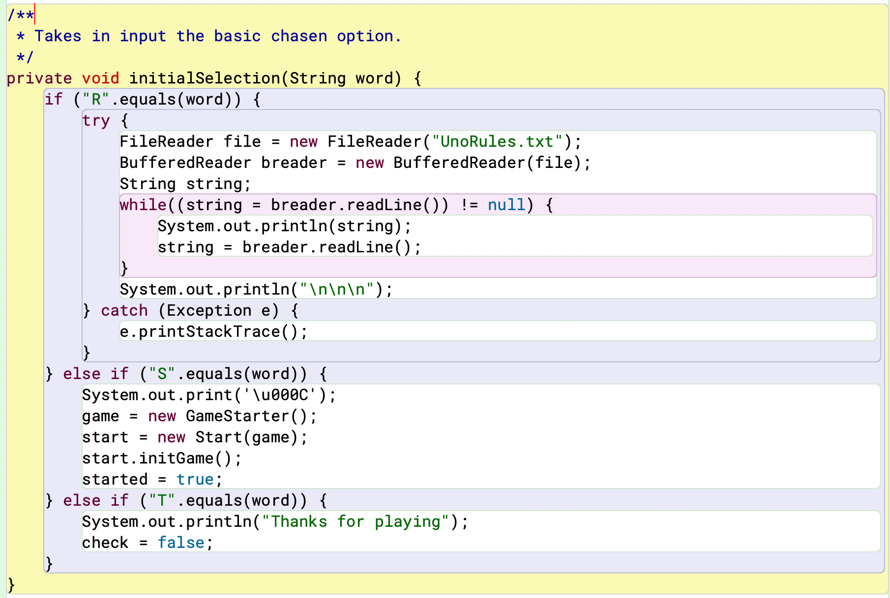
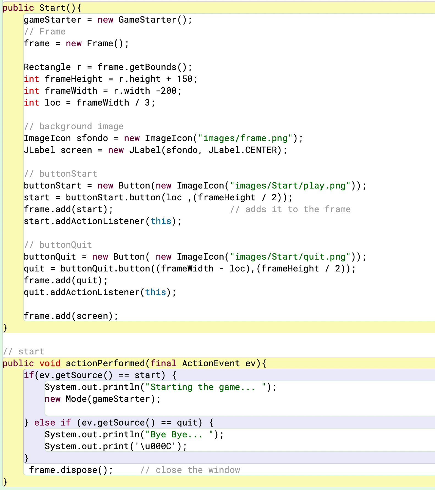
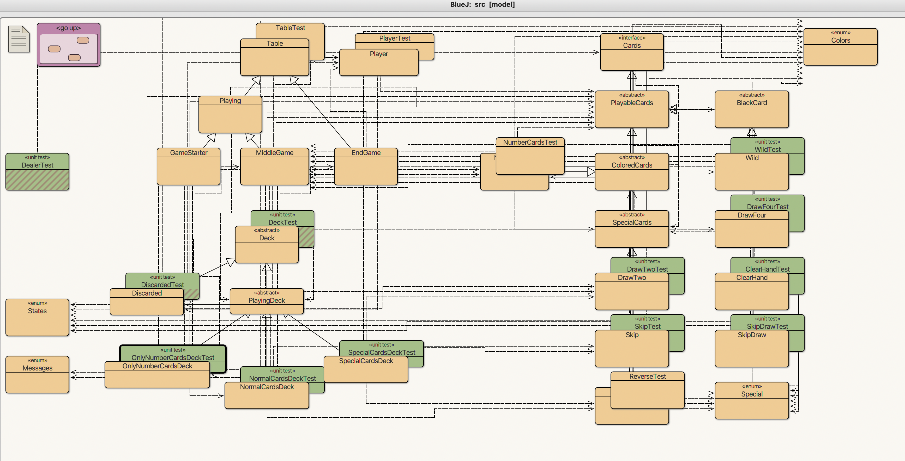
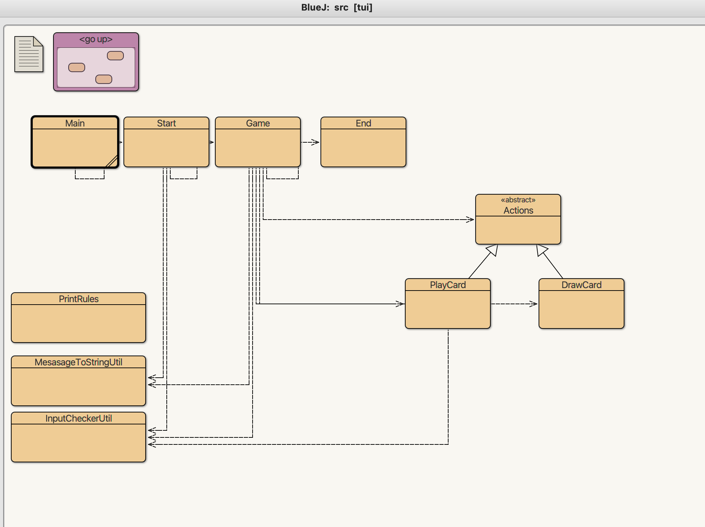
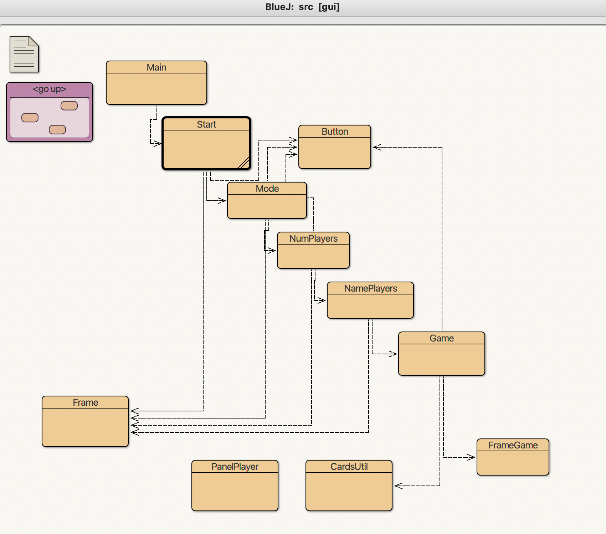

# Project title 

* uno-momento

# Project PROJECTNAME

uno-momento is a java programm based on one of the most influential card game UNO

## Team Members

* Nicola Fontana
* Cristiano Masutti

# Rules 

Welcome to UnoMomento!!!
The game is easy to play. 
Each player starts with 7 cards in his hands.
At each turn a player must throw a card on the discarded deck; the card must match the color or the number of the the card on top of the deck
If a player doesn't have a card he must draw from the deck in the middle of the table
If a plyer is left with one card he must press the button 'UNO', otherwise he will have to draw two cards
Special cards: 
SKIP will make the next player skip a turn
REVERSE will change the direction of the game
PLUSTWO will make the next player draw two cards (if he doen't have a plus two too
BLACK:
WILD will change the color of the discarded deck
PLUSFOUR it the same as the PLUSTWO card but with four cards and will change the color of hte discarded deck
Modes:
Classic: cards with colors and numbers, special cards
Special: only special cards
Custom: only black cards

# TUI
Our text user interface let the player play the game, by creating an instance of the Main class and calling on it the method run the game will start (method run())
Players must enter key "s" to start the game  (initialSelection(String word))
The mode of the game; by pressing "1" a classic game (numbered cards, specials, blacks), "2" special-mode (only special cards) or "3" for our favorite; custom mode (with only black cards) (method initDeck())
Choose how many players are going to play (key "2", "3", "4") and then the name... You are in! (method initPlayers())



# GUI
We created our GUI from our TUI; the same-like methods do the same thing but instead of taking input keys, it takes JButtons


# Diagrams




## Project Structure

This project is both a Maven project and a BlueJ project.
You can open, compile, test, and run the code within BlueJ
by opening `src/package.bluej`.

You can use Maven to compile, test, and check the code
by running `mvn` in this top-level directory (see below).

You can run the code compiled by Maven from the terminal (see below).

The code is structured into three packages:

* `model` - all the model classes and their tests
* `tui` - text user interface (works in a terminal)
* `gui` - Swing-based graphical user interface (opens a window)

Note that the classes in the `model` package MUST NOT refer to any
classes in the `tui` or `gui` packages.

The classes in the `tui` package must not refer to any classes in the `gui` package.

The classes in the `gui` package must not refer to any classes in the `tui` package.

The classes in the `tui` and `gui` packages SHOULD refer to classes in the `model` package.

The classes in the `model` package need to come with unit tests.
(The classes in the `tui` and `gui` packages do not need to be covered with tests.)

## How build using Maven

In this top-level directory:

```bash
mvn compile
```

## How to run the application

To run the application from outside BlueJ, first build it with Maven.
This generates the compiled classes in the directory `target/classes`.

### Running the TUI

To run this application, with the TUI, from the command line:

```bash
java -cp target/classes tui.Main ARG ARG ARG
```

DESCRIPTION OF COMMAND LINE ARGUMENTS

### Running the GUI

To run this application, with the GUI, from the command line:

```bash
java -cp target/classes gui.Main ARG ARG ARG
```

DESCRIPTION OF COMMAND LINE ARGUMENTS

### How run the JUnit tests with Maven

```bash
mvn test
```

### How to run Checkstyle with Maven

```bash
mvn compile
mvn checkstyle:check
```

### How to run PMD with Maven

```bash
mvn compile
mvn pmd:check
```

### How to run PMD's CPD with Maven

```bash
mvn compile
mvn pmd:cpd-check
```

### How to determine test coverage with Maven

```bash
mvn site
```

Then open `target/site/index.html` and find the JaCoCo report.
